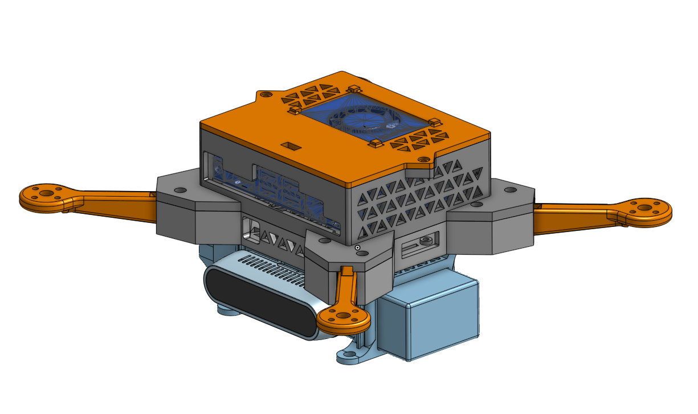
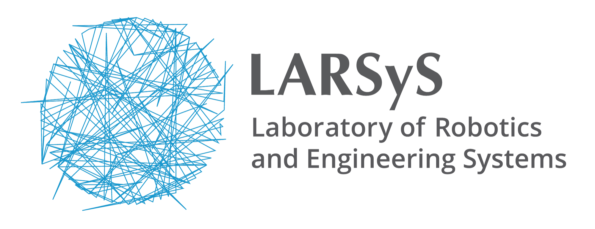

# Pegasus CAD Model V1.0.0

This repository contains the CAD model of the Pegasus quadrotor. The model was designed using Onshape and is available in step and stl formats. The model is composed of the following parts:
* 4x Motor Arms
* A bottom base for electronics (4in1 ESC and Flight Controller)
* A bottom base for the onboard computer (Jetson Orin Nano Dev Kit)
* The top shell of the computer
* The feet which hold the battery and an Intel Realsense d435i camera

   

## Developer Team for V1.0.0
* [Marcelo Jacinto](https://github.com/MarceloJacinto)

## Documentation
The documentation for the Pegasus CAD model is available [here]().

## License

## Project Sponsors
The work developed by Marcelo Jacinto was supported by Ph.D. grant funded by Fundação para a Ciência e Tecnologia (FCT).

   
   
   
   

