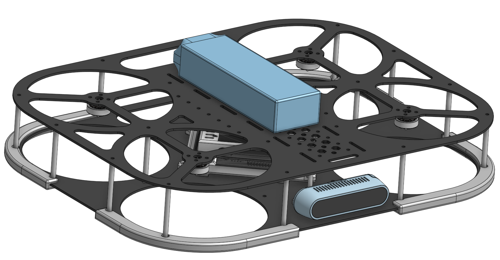

# Pegasus CAD Model

This repository contains the CAD model of the Pegasus quadrotors. The model was designed using Onshape and is available in step and stl formats.

There are two models available:

- **Version 2 (2024-2025):** The second version of the Pegasus quadrotor. This version has a carbon fiber frame and 3D printed parts. It was developed to be safer for flights near people.

   

  * Developer Team:
    
    * Project Founder and drone frame designer: [Marcelo Jacinto](https://github.com/MarceloJacinto)
    * New Jetson Slim Case Design: [Luís Abrantes](https://github.com/abrantessss)  
    * Drone Support Feet [Rodrigo Gomes](https://github.com/rodrigofpgomes)  

- **Version 1 (2023-2024):** The first version of the Pegasus quadrotor. This version has a full 3D printed frame without requiring any expensive carbon fiber parts. It was developed to be a low-cost platform for research and education.

   

* Developer Team: [Marcelo Jacinto](https://github.com/MarceloJacinto)

## Documentation
The documentation for the Pegasus CAD model is available [here](https://pegasusresearch.github.io/pegasus/source/vehicles/pegasus/pegasus.html).

## License
The CAD models were developed using Onshape and are provided for free for research purposes. You must not use these models for commercial purposes. The models are licensed under the Creative Commons Attribution-NonCommercial-ShareAlike 4.0 International License. To view a copy of this license, visit [https://creativecommons.org/licenses/by-nc-sa/4.0/](https://creativecommons.org/licenses/by-nc-sa/4.0/).

## Project Sponsors
The work developed by Marcelo Jacinto was supported by Ph.D. grant funded by Fundação para a Ciência e a Tecnologia (FCT).

   
   
   
   

